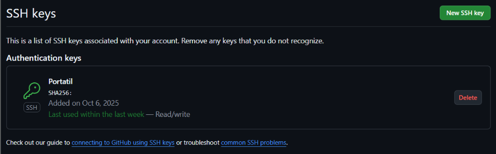

# Hito 1: Repositorio de prácticas y definición del proyecto

## Creación del repositorio

<p align="center">
  
</p>

* **Problema a resolver:** incluido en el [`README.md`](../README.md).

* **Licencia:** siguiendo el enlace integrado en la parte de [licencia](https://choosealicense.com/) he optado por la [`GNU GPLv3`](../LICENSE), porque permite al resto de personas utilizar y modificar el proyecto, pero prohíbe distribuir versiones de código cerrado, promoviendo así el compartir mejoras.

* **Ignorar ficheros:** se usa la plantilla de VisualStudio porque es el IDE que se va a usar en el desarrollo de la aplicación y, en caso de que se generen otros ficheros a ignorar no incluidos, simplemente se añadirán.

* **Documentación:** para la documentación se ha creado una carpeta donde se subirán los *markdown* de cada hito y se enlazarán en el [`README.md`](../README.md).

## Configuración del entorno

* **Claves:** he creado las claves y he añadido la pública a la cuenta de GitHub.
<br><br>

<p align="center">
  
</p>
<p align="center">
  
</p>

<br>

* **Nombre y correo electrónico.**

```bash
    $ git config --global user.name "Lorena"
    $ git config --global user.email lorenacastellanofdez@gmail.com
```

* **Perfil.**

    


* **Segundo factor de autenticación.**

    


