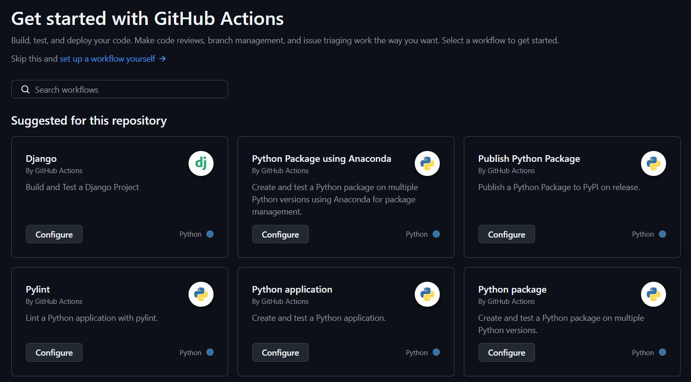
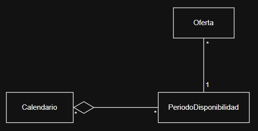

# Hito 2: Integración Continua.

## Preparación del proyecto
Para la realización del proyecto, he decidido utilizar el framework **Django**. Razones por las que lo selecciono:

* He trabajado con él previamente.
* Voy a desarrollar el proyecto en Python, y Django es uno de los framework estándar para ello.
* Tiene un sistema de gestión de base de datos (ORM) que permite utilizar objetos y clases de Python, en lugar de escribir las consultas SQL, lo que simplifica el trabajo.

### Gestor de tareas
Como gestor de tareas, he decidido utilizar **invoke**. Razones por las que lo selecciono:

* Se integra con Python y Django (usa scripts .py).
* Facilita la ejecución de tests localmente y en entornos CI con un mismo comando (`invoke test`).
* Permite que la ejecución de las tareas del proyecto sea siempre uniforme y consistente (siempre es `invoke <tarea>`).
* Se pueden automatizar y encadenar varias tareas en una sola orden, lo que simplifica el flujo de trabajo.

### Biblioteca de aserciones y test runner
Como biblioteca de aserciones y test runner, he decidido utilizar **pytest**. Razones por las que lo selecciono:

* Tiene total compatibilidad con Django.
* Aunque Django ya incluye un sistema de testing (`django.test`), este está basado en `unittest` que tiene una sintaxis tediosa, mientras que con pytest la sintaxis es clara y concisa (basta con usar `assert`).
* Cuando un test falla, muestra automáticamente los valores esperados y obtenidos, y resalta exactamente en qué línea ocurre el error, lo que facilita mucho la depuración.
* Cuenta con fixtures, que son entornos de prueba que se pueden crear para ejecutar varios tests que utilicen unas mismas condiciones iniciales, evitando repetir líneas de código dentro de los mismos.
* Se pueden detectar automáticamente los tests siguiendo las convenciones de nombres (`test_*.py`).

### Sistema de integración continua (CI)
Como sistema de integración continua (CI), he decidido utilizar **GitHub Actions**. Razones por las que lo selecciono:

* Es gratuito y compatible con Python y Django.
* Está completamente integrado con GitHub.
* Los workflows se activan automáticamente con eventos del repositorio.
* Facilita la configuración inicial gracias a la existencia de plantillas listas para distintos entornos y frameworks.

## Creación inicial del entorno

Aquí se detalla construcción del esqueleto/estructura del proyecto desde la nada. Para realizar la configuración partiendo del repositorio se detalla en [`README.md`](../README.md)

### Inicializar proyecto Django
```bash
  django-admin startproject proyecto .
  python -m venv venv
  venv\Scripts\activate
  python manage.py startapp app
  pip install djangorestframework
```
En `proyecto/settings.py` añadir <br>
>&nbsp;&nbsp;&nbsp;&nbsp;INSTALLED_APPS = [ <br>
>&nbsp;&nbsp;&nbsp;&nbsp;&nbsp;&nbsp;&nbsp;&nbsp;[...], <br>
>&nbsp;&nbsp;&nbsp;&nbsp;&nbsp;&nbsp;&nbsp;&nbsp;**'app'**, <br>
>&nbsp;&nbsp;&nbsp;&nbsp;&nbsp;&nbsp;&nbsp;&nbsp;**'rest_framework'**, <br>
>&nbsp;&nbsp;&nbsp;&nbsp;]

### Instalar dependencias de testing
```bash
  pip install pytest pytest-django invoke
  pip install pytest-cov
```
### Configurar pytest
Crear `pytest.ini`
>[pytest]<br>
>DJANGO_SETTINGS_MODULE = proyecto.settings<br>
>python_files = tests.py test_*.py *_tests.py<br>
>addopts = --cov=. --cov-report=term-missing<br>

### Guardar dependencias
```bash
  pip freeze > requirements.txt
```

### Ignorar archivos
En `.gitignore` añadir <br>
> \# Entorno virtual<br>
> venv/<br>
> .env/<br>
> <br>
> \# Archivos de caché<br>
> __pycache__/<br>
> *.py[cod]<br>
> *.log<br>
> <br>
> \# Base de datos local<br>
> db.sqlite3<br>
> <br>
> \# Archivos de pruebas<br>
> .coverage<br>
> .pytest_cache/<br>

### Configurar GitHub Actions
He utilizado la plantilla proporcionada por GitHub Actions de Django, añadiendo Build DB para que se migre la base de datos, modificando Run Test para que utilice pytest y cambiando las versiones de python por la 3.10 que es la mínima requerida. El resultado ha sido [`django.yml`](../.github/workflows/django.yml).
<p align="center">
  
</p>

## Metodología de desarrollo
Se utiliza TDD (Test-Driven Development) como metodología de desarrollo debido al enfoque que tiene en la calidad y la verificación continua del código. Dado que se usa Integración Continua, el hecho de que los tests se escriban antes de implementar la funcionalidad asegura que cada función cumpla con los requisitos desde el inicio. Complementado con GitHub Actions, cada commit o pull request ejecutará automáticamente los tests, de forma que si cualquier cambio estropea algún funcionamiento se detecta rápidamente.

Para poner a prueba esta estrategia, en primer lugar se han planteado tests relativos a las HU 1 a 3:
* **HU1.** Como propietario, debo poder hacer una propuesta de trabajo para un período determinado.
  - test_crear_oferta
* **HU2.** Como jornalero, debo poder tener un calendario de disponibilidad.
  - test_crear_calendario
* **HU3.** Como jornalero, debo poder editar mi calendario de disponibilidad.
  - test_incluir_periodo
  - test_quitar_periodo

Posteriormente, se ha pensado la estructura que seguirán los datos mediante un diagrama, para implementar los modelos usándolo de base:
 <p align="center">
  
</p>


Finalmente, al probar los test y detectar los fallos, pueden surgir nuevas funciones necesarias y a probar para completar la validación. En mi caso, se ha visto que uno de los test fallaba (quitar_periodo). Para localizar el fallo, se ha planteado un nuevo test para probar la disponibilidad. Este último test también ha fallado, siendo el error que si la disponibilidad está segmentada en dos periodos contiguos o solapados no se detecta. Se ha diseñado otra función de fusión para que dichos periodos se unan, creándole inicialmente su propio test para validarla tras implementarla.

Una vez corregidos los errores, se ha vuelto a iterar sobre el proceso añadiendo tests para incluir a los propietarios y jornaleros y combinarlos con la iteración anterior.
* Diagrama resultado al final del hito:
* Tests al final del hito:


