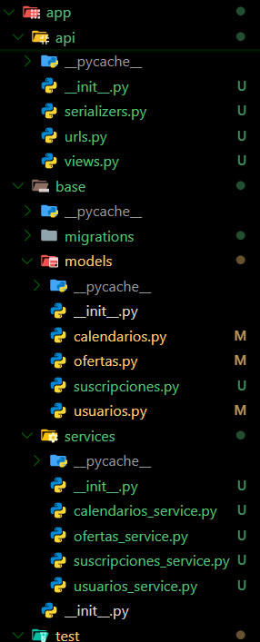
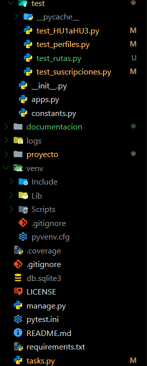
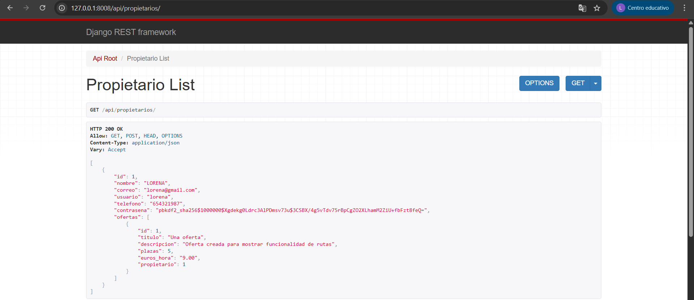
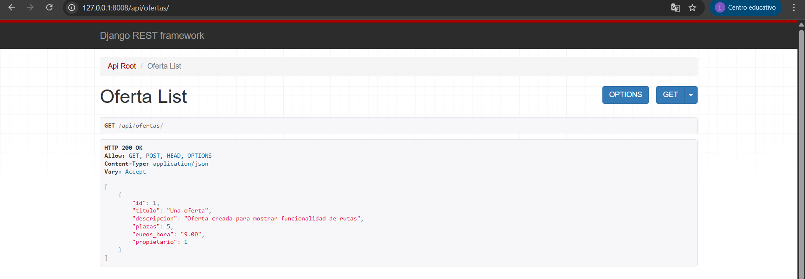
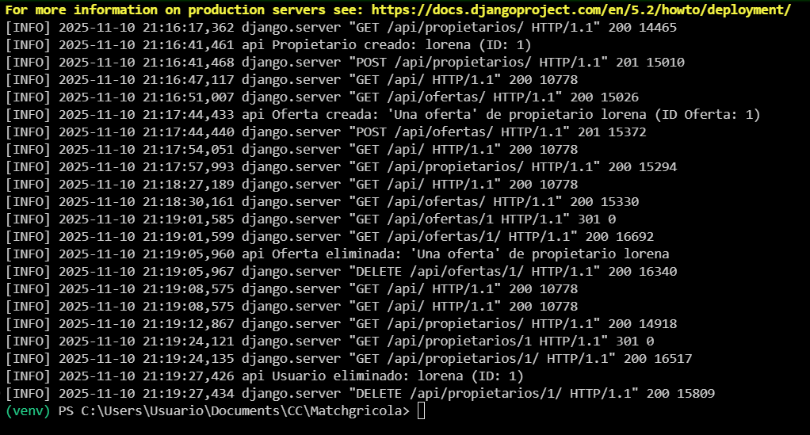
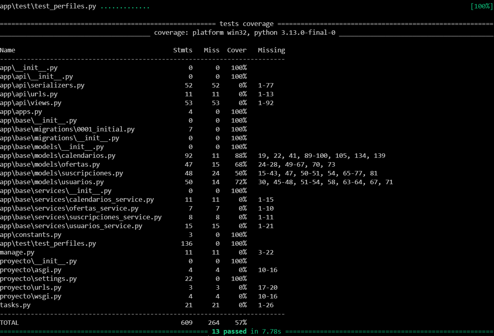
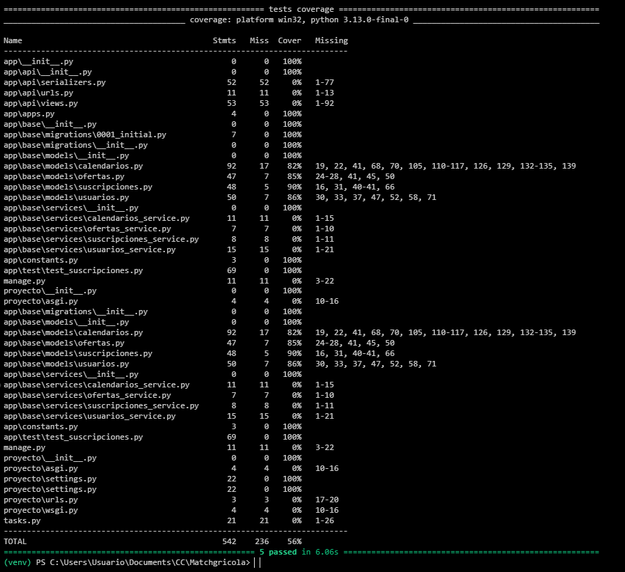

# Hito 3: Diseño de microservicios.

## Framework para el microservicio
Como ya expuse en el hito anterior, el framework elegido para la realización del proyecto es **Django**. Las razones eran:

* He trabajado con él previamente.
* Voy a desarrollar el proyecto en Python, y Django es uno de los framework estándar para ello.
* Tiene un sistema de gestión de base de datos (ORM) que permite utilizar objetos y clases de Python, en lugar de escribir las consultas SQL, lo que simplifica el trabajo.

Concretamente, he optado por el uso de **Django REST Framework (DRF)** para que empiece a tomar forma el producto mínimo viable del backend, separando completamente la lógica de negocio de la API y teniendo módulos dedicados para cada servicio. Las razones son:

* Ofrece una interfaz web interactiva que permite probar fácilmente las peticiones y respuestas de la API, resultando muy útil para un testeo manual durante el desarrollo y la depuración.
* Se integra con el ORM de Django, manteniendo la coherencia del modelo de datos.
* Favorece la separación entre la lógica de negocio y la capa de presentación de la API.

## Diseño de la arquitectura

Como el proyecto no será muy grande, utilizo una arquitectura en capas que separe las responsabilidades de acceso a datos, lógica de negocio y exposición de la API. 

  
  

Cada módulo del proyecto se organiza de forma que las dependencias fluyan en una sola dirección:

API -> Servicios -> Modelos -> BD

Así, cada capa tiene una responsabilidad bien definida y no accede directamente a capas inferiores, sino de manera controlada. De esta forma se facilita el mantenimiento, la escalabilidad y los test.  

En caso de que el sistema crezca en un futuro e interesase evolucionarlo hacia una arquitectura DDD (Domain-Driven Design) podría hacerse sin grandes cambios estructurales. Habría que dividirlo en microservicios completamente independientes, bastando con trasladar los módulos actuales a repositorios separados, ya que la estructura interna está preparada para ello (separación lógica y mínima dependencia entre componentes).

Lo hago así para simplificar el flujo del trabajo, evitando la necesidad de navegar por distintos repositorios para realizar pequeñas implementaciones o modificaciones.

### Descripción de capas

* **Models:** contiene las entidades principales (tablas del modelo de datos) y las funciones que interactúan directamente con la BD.
* **Services:** define la lógica de negocio y las operaciones que utilizará la API. Esta capa no interactúa directamente con la BD, sino que hace uso de funciones y métodos definidos en `models`. De esta forma, la lógica de negocio queda desacoplada del acceso a datos, facilitando la reutilización y mantenimiento.
* **Test:** casos de prueba para cada capa que garantizan la integridad del sistema y permiten validar el correcto funcionamiento de la aplicación ante cambios o nuevas implementaciones.
* **Api:** capa donde se sitúan serializers, views y urls.
  - **Serializers:** capa intermedia entre el modelo y la API, validando los datos de entrada antes de que lleguen a la lógica de negocio.
  - **Views:** definen los endpoints y gestionan las peticiones utilizando los `services` para ejecutar la lógica correspondiente.
  - **Urls:** contienen las rutas que exponen los distintos endpoints de la API y los vinculan con las `views`.

## Sistema de logs
Para el registro de actividad de la API implemento un sistema de logs utilizando el módulo estándar `logging` de Django, guardando los registros tanto en consola como en un fichero `logs/api.log` que se incluye en el [`.gitignore`](../.gitignore). Se registran eventos de la API, errores y actividad del microservicio, permitiendo un seguimiento completo del funcionamiento en producción.

Breve muestra: crear un propietario, añadirle una oferta y eliminar ambos.

   
   
  

## Ejecución de test

### Funcionalidad ampliada

* [`test_perfiles.py`](../app/test/test_perfiles.py) (HU1-HU3): tests que prueban la funcionalidad básica de las entidades jornalero junto a su calendario y propietarios junto a sus ofertas.

  

* [`test_suscripciones.py`](../app/test/test_suscripciones.py) (HU4-HU8): tests que prueban la funcionalidad de suscribirse a ofertas por parte de los jornaleros y aceptarlas o rechazarlas por parte de los propietarios.

  

### Rutas
*Aún hay fallos, por lo que voy a realizar cambios en la estructura existente de datos antes de actualizar el proyecto en el repositorio. La arquitectura y jerarquía de directorios se mantendrá como se describe.*

