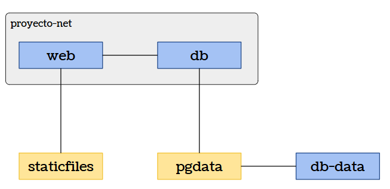
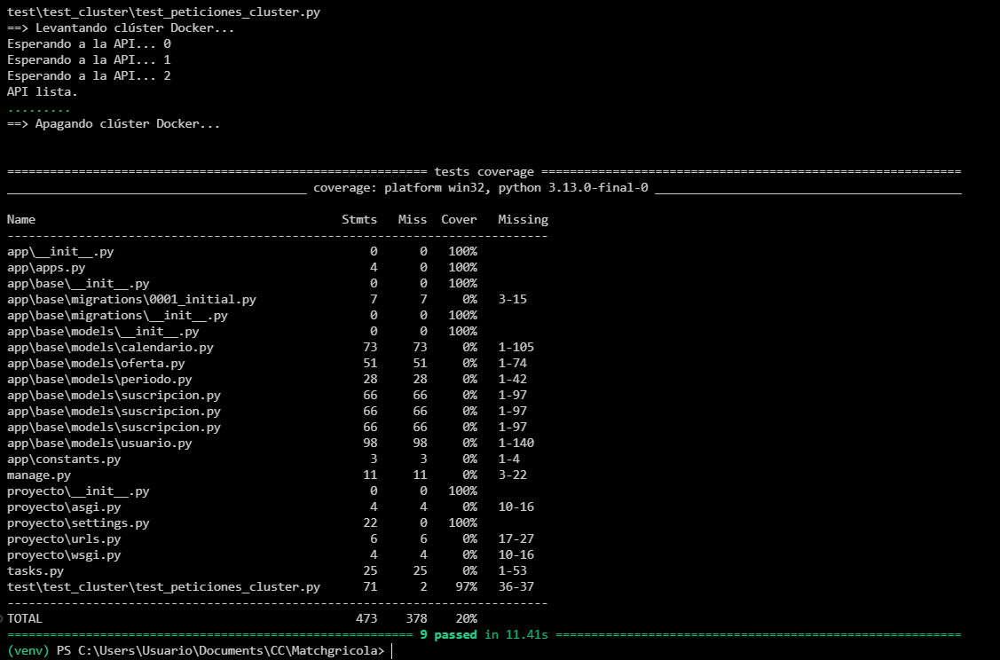
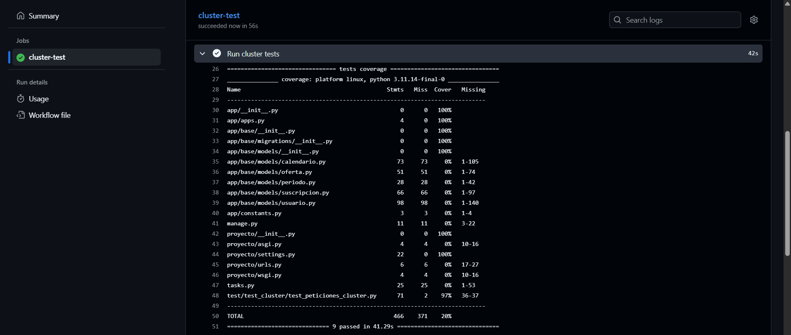

# Hito 4: Composición de contenedores.

## Estructura del clúster

<p align="center">
  <br>
</p>

El clúster está compuesto por tres contenedores principales:

- **db-data:** su única función es asegurar que los volúmenes necesarios para PostgreSQL existen antes de levantar el servicio db.
- **db:** es el contenedor de uso exclusivo para almacenar los datos.
- **web:** es el contenedor central del proyecto, que ejecuta la aplicación Django y expone las rutas de la API REST.

Además, se incluyen volúmenes para mantener la persistencia aunque los contenedores se eliminen, **pgdata** para almacenar los datos de la BD y **staticfiles** para almacenar los estáticos del web (sin estos no se veía el estilo de la página).

Por últmo, la red **proyecto-net** permite que web y db se puedan comunicar sin exponer la BD al exterior.

## Configuración de cada contenedor

### db-data

```
    db-data:
      image: busybox
      volumes:
        - pgdata:/var/lib/postgresql/data
      command: ["true"]
```

Utiliza como imagen *busybox* porque es muy ligera (contiene únicamente herramientas mínimas de Unix), así que minimiza el tamaño del clúster y acelera la descarga/arranque para este contenedor que no ejecutará ningún servicio, sino que solo existe para declarar un volumen persistente.

**Configuración:** Declara el volumen *pgdata* y el comando ["true"] evita que el contenedor se quede en ejecución, solo garantiza que el volumen existe antes de levantar PostgreSQL.

### db

```
    db:
      image: postgres:15
      container_name: proyecto-db
      environment:
        POSTGRES_DB: proyecto
        POSTGRES_USER: proyecto
        POSTGRES_PASSWORD: proyecto
      volumes:
        - pgdata:/var/lib/postgresql/data
      networks:
        - proyecto-net
```

Utiliza como imagen *postgres:15* porque PostgreSQL es el motor SQL recomendado por Django.

**Configuración:** Se inicializa la BD mediante las variables de entorno, se asigna el volumen *pgdata* (persistencia incluso entre reinicios) y se incluye en la red *proyecto-net* (no está expuesta al exterior = más seguro).

### web

```
    web:
      build:
        context: .
        dockerfile: Dockerfile
      container_name: proyecto-web
      depends_on:
        - db
      environment:
        POSTGRES_DB: proyecto
        POSTGRES_USER: proyecto
        POSTGRES_PASSWORD: proyecto
        DB_HOST: db
        DB_PORT: 5432
        DJANGO_SETTINGS_MODULE: proyecto.settings
      ports:
        - "8000:8000"
      networks:
        - proyecto-net
      volumes:
        - staticfiles:/app/staticfiles
```
**Configuración:** Se construye a partir del *Dockerfile* del proyecto, se declara la dependencia explícita con *db* para garantizar que la base de datos esté iniciada antes de arrancar Django, se configuran las variables necesarias para que la aplicación pueda conectarse a PostgreSQL dentro de la red interna, se expone el puerto 8000 al exterior para permitir el acceso a la API REST, usa el volumen *staticfiles* para almacenar los estáticos (y que se vea el estilo) y se incluye también en la red *proyecto-net* para comunicarse con la base de datos sin exponerla públicamente.

#### Dockerfile del contenedor web

```
  FROM python:3.11-slim

  # No escribir .pyc y usar buffering de stdout/stderr
  ENV PYTHONDONTWRITEBYTECODE=1
  ENV PYTHONUNBUFFERED=1

  WORKDIR /app

  # Crear usuario no-root para la app
  RUN groupadd -r app && useradd -r -g app app

  # Dependencias del sistema necesarias para compilación y netcat para esperar DB
  RUN apt-get update && apt-get install -y --no-install-recommends \
      build-essential \
      gcc \
      libpq-dev \
      netcat-openbsd \
    && rm -rf /var/lib/apt/lists/*

  # Copiar fichero de requerimientos e instalar
  COPY requirements.txt /app/requirements.txt
  RUN pip install --upgrade pip
  RUN pip install -r /app/requirements.txt

  # Copiar el resto de la app
  COPY . /app

  # Copiar entrypoint y hacerlo ejecutable
  COPY entrypoint.sh /usr/local/bin/
  RUN chmod +x /usr/local/bin/entrypoint.sh

  # Escucha en el puerto 8000
  EXPOSE 8000

  # Ejecutar entrypoint (recopila estáticos, lanza migraciones y comienza gunicorn)
  CMD ["entrypoint.sh"]
```

Se utiliza como imagen base *python:3.11-slim* porque es una imagen ligera que incluye una versión moderna y optimizada de Python compatible con Django.

Sobre esta imagen se instalan las dependencias necesarias para que la aplicación pueda ejecutarse en un entorno aislado y reproducible (las librerías del sistema requeridas para compilar extensiones de Python y para esperar a que la base de datos esté disponible, los requisitos Python del proyecto y todo el código fuente), asegurando que el contenedor contiene una versión completa y autocontenida de la aplicación. 

Finalmente, se incorpora un entrypoint que automatiza las tareas (recopilación de estáticos, migraciones y arranque del servidor). Para arrancar el servidor que exponga la API REST se utiliza Gunicorn porque es un servidor WSGI robusto, eficiente y ampliamente utilizado en despliegues de Django. Además, gestiona múltiples workers, ofreciendo concurrencia y mejor rendimiento que el servidor de desarrollo de Django.

## Publicación en GitHub Packages y actualización automática

Para garantizar que la imagen Docker del microservicio web se publique automáticamente cada vez que se actualiza el repositorio, se ha configurado un workflow de GitHub Actions denominado [`docker-publish.yml`](../.github/workflows/docker-publish.yml). 

Este workflow construye la imagen del contenedor web y la sube a GitHub Packages utilizando como registro ghcr.io y el DOckerfile para construir la imagen. Cada vez que se hace push a la rama main, GitHub Actions reconstruye la imagen del contenedor, la etiqueta como latest y la publica automáticamente en GitHub Packages, lo que garantiza que siempre haya una versión actualizada del microservicio lista para ser usada en despliegues.

## Composición del clúster

La composición del clúster se define en el archivo [`compose.yaml`](../compose.yaml), ya expuesto previamente por partes en el apartado [Configuración de cada contenedor](#configuración-de-cada-contenedor). Lo único que ha cambiado en este punto es que en el *web* se utiliza la imagen publicada para la construcción del contenedor.

```diff
web:
-  build:
-    context: .
-    dockerfile: Dockerfile
+  image: ghcr.io/lorena47/matchgricola-web:latest
   container_name: proyecto-web
   [...]
```


## Test de validación del funcionamiento del clúster
El test se encuentra en el archivo [`test_peticiones_cluster.py`](../test/test_cluster/test_peticiones_cluster.py), en el que se utiliza una fixture para levantar el cluster, se realizan test de varias peticiones y la misma fixture apaga el cluster.

He probado la ejecución del test en la máquina:

<p align="center">
  <br>
</p><br>

Además, este test forma parte del flujo de integración continua definido en GitHub Actions. Cada vez que se actualiza el repositorio, la acción ejecuta automáticamente el test como parte de la validación del clúster:

<p align="center">
  <br>
</p>