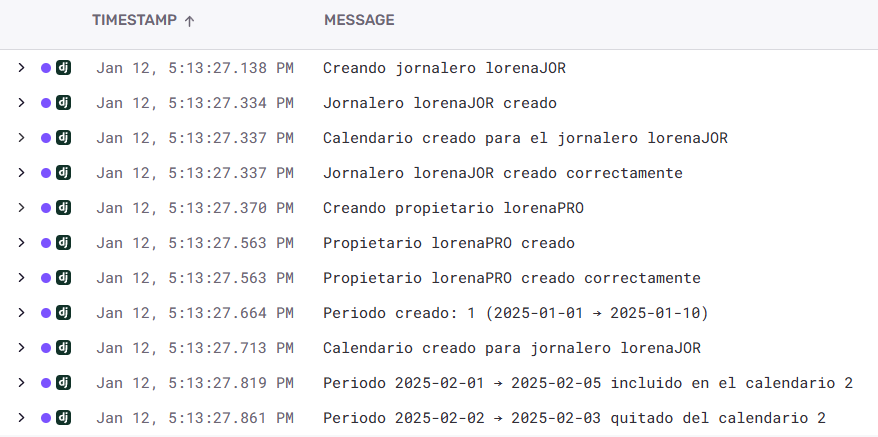
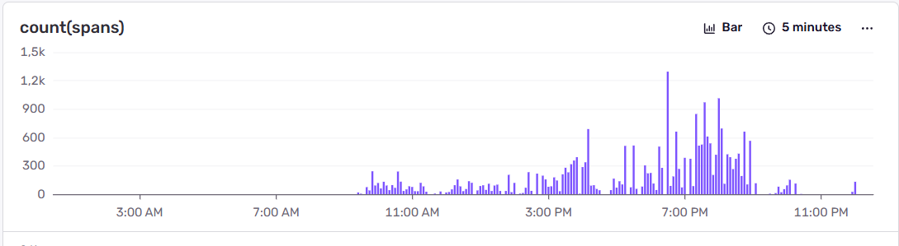
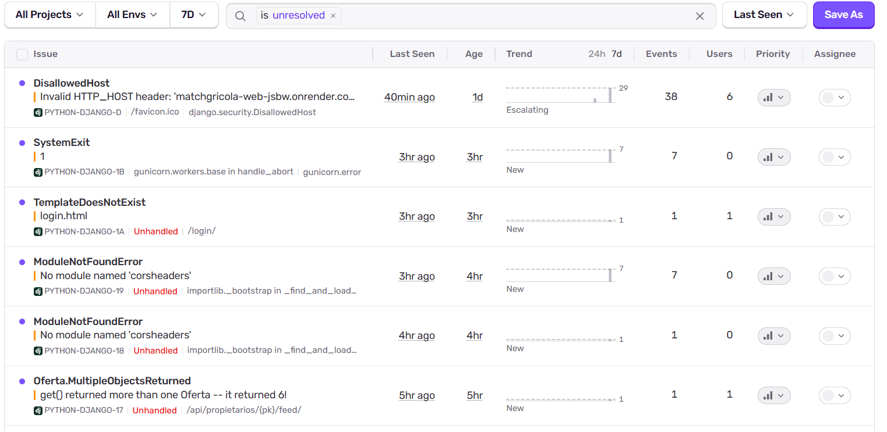
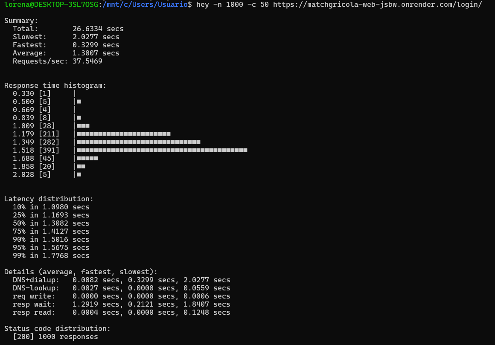

# Hito 5: Despliegue.

[Aplicación desplegada en Render](https://matchgricola-web-jsbw.onrender.com/login)

## Elección del Paas

Para el despliegue he decidido utilizar Render como proveedor PaaS. Antes de tomar esta decisión valoré otras alternativas como Heroku o Railway, pero finalmente opté por Render por su equilibrio entre simplicidad, funcionalidad y adecuación a los requisitos de la práctica.

Render permite integrar directamente un repositorio de GitHub y realizar despliegues automáticos con cada push, sin necesidad de intervención manual. Además, ofrece soporte nativo para aplicaciones Dockerizadas y bases de datos PostgreSQL gestionadas, como es el caso de mi proyecto. También tiene la posibilidad de desplegar servicios en regiones europeas, lo cual es un requisito legal (y del propio hito) importante.

Otro factor clave para escoger Render es que la infraestructura y el despliegue pueden definirse completamente mediante un fichero de configuración, en lugar de depender únicamente de configuración manual desde la interfaz web. En este proyecto he utilizado el fichero [`render.yaml`](../render.yaml), donde se describen los servicios necesarios, el tipo de servicio, los comandos de arranque y las variables de entorno requeridas para la aplicación, de forma que cualquier persona que se dé de alta en Render y tenga acceso al repositorio puede reproducir la infraestructura y desplegar exactamente la misma aplicación. Esto cumple con el objetivo de definir la infraestructura como código y garantiza la reproducibilidad del despliegue.

Por último, también me he quedado con Render por la facilidad de uso de la plataforma y la claridad de sus logs.

## Herramientas utilizadas para el despliegue

La aplicación se ha desplegado utilizando Docker, lo que me ha permitido garantizar que el entorno de ejecución en producción sea coherente con el utilizado durante el desarrollo en local. Para ello he utilizado el [`Dockerfile`](../Dockerfile) del hito anterior.

La base de datos utilizada es PostgreSQL (igual que en mi cluster), proporcionada como servicio gestionado por Render, lo que elimina la necesidad de administración manual y mejora la fiabilidad del despliegue.

## Configuración del despliegue automático desde GitHub

El despliegue de la aplicación se realiza de forma completamente automática a partir del repositorio de GitHub. Cada vez que realizo un push a la rama principal (main), Render detecta los cambios y lanza un nuevo despliegue sin necesidad de acciones adicionales.

   

Durante el despliegue se ejecutan automáticamente las migraciones de Django y la recopilación de archivos estáticos, asegurando que la aplicación quede operativa tras cada actualización.

## Herramientas de observabilidad y monitorización

Para la monitorización en tiempo real de la aplicación he integrado Sentry como herramienta de observabilidad. Sentry me permite capturar errores, excepciones, eventos y trazas de la aplicación tanto en desarrollo como en producción.

La integración se ha realizado directamente en la configuración de Django, de forma que cualquier excepción no controlada se envía automáticamente a Sentry junto con información relevante de la petición, el entorno y el usuario, lo que permite detectar fallos rápidamente y analizar su causa sin necesidad de reproducirlos manualmente.

   

   

   

Además, Render proporciona logs en tiempo real del contenedor, lo que facilita el seguimiento del estado de la aplicación, el arranque del servicio y posibles problemas de rendimiento.

## Funcionamiento correcto del despliegue

Una vez desplegada la aplicación, he comprobado su correcto funcionamiento accediendo a todas las funcionalidades principales desde la URL pública. El sistema de autenticación permite registrar usuarios e iniciar sesión sin problemas.

Las vistas correspondientes a propietarios y jornaleros funcionan correctamente, permitiendo crear ofertas, suscribirse a ellas, aceptarlas o rechazarlas, y reflejar estos cambios correctamente en la base de datos. La API REST responde de forma consistente y estable.

_Enlace al vídeo de la presentación cuando lo grabe_

## Pruebas de las prestaciones de la aplicación desplegada en el Paas

Para evaluar las prestaciones de la aplicación desplegada he realizado pruebas de carga automatizadas utilizando la herramienta hey.
Estas pruebas se han centrado en la pantalla de login, ya que se trata de un endpoint público que no requiere autenticación previa y permite medir el rendimiento real del servidor sin interferencias derivadas de control de sesiones o permisos.

   

